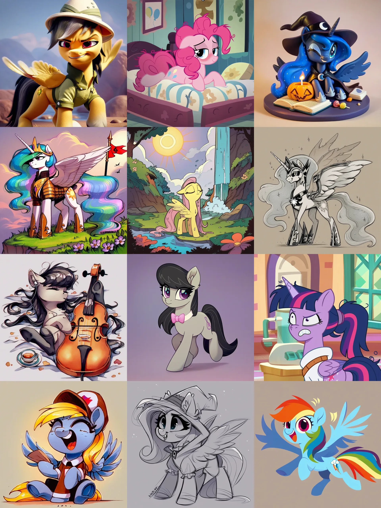

# Pony Diffusion Styles Collection
This is a Pony Diffusion [V5](https://civitai.com/models/95367/pony-diffusion-v5)/[V6](https://purplesmart.ai) styles collection for [AUTOMATIC1111's Stable Diffusion Web UI](https://github.com/AUTOMATIC1111/stable-diffusion-webui).

> [!IMPORTANT]
> **New in 1.1:**
> * IRL Ponies Style
> * Improved IDW Comic style
> * Race Swap collection

# Installation
### A1111 v1.7+
Head on over to the [releases](https://github.com/Siberpone/pd-styles/releases/latest) page and download one or several .csv files:

* `styles-pd-common.csv` contains small useful style- and model-agnostic snippets and modifiers;
* `styles-pd-v5.csv` contains styles for legacy V5/V5.5 models;
* `styles-pd-v6.csv` contains styles for the newest V6 XL model;
* `styles-pd-v6-race-swap.csv` contains snippets for swapping character's race.

Once you've downloaded the desired files, put them into the root webui directory and add an additional launch parameter to the webui:

* linux: `--styles-file="./styles*.csv"`
* windows: `--styles-file=".\styles*.csv"`

Styles should now appear in the webui's styles drop-down under the "Generate" button.

### A1111 Older Versions
You'll have to merge the desired *.csv file's content with your `.../stable-diffusion-webui/styles.csv` manually.

# Usage
The styles were tuned and designed with distinction, consistency and modularity in mind. They should work reasonably well on wide variety of prompt lengths and prompting styles. The model-specific files (`styles-pd-v*.csv`) consist of two sections: "Utility" and "Styles". "Utility" contains model-specific useful snippets that are not directly related to styling (built-in quality tags like `score_9`, negative prompt snippets and so on), while the "Styles" section contains the main styles themselves (duh). The `styles-pd-common.csv` contains generally useful small snippets that are model-agnostic and can be applied liberally to any style. The file contains two sections: "Utility" and "Modifiers". "Utility" mostly contains character's species/form meta tags and some other useful snippets. "Modifiers" are little style-agnostic snippets that modify style in some way. Like, for example, "Fluffifier" makes ponies more fluffy. These can be used with any style.

### Recommended Workflow

1. Select "Pony Prompt Base"
2. *(optional)* Select meta tags for your character from the common "Utility" section
3. Select desired style
4. Select "Default Negative"
5. Write your prompt
6. ...
7. poni 🦄

Generally, I would recommend not to spam "soup words" and keep prompts concise and to the point. [Derpi tags](https://derpibooru.org/tags) work the best, but short natural language descriptions also work decently.

### Icon Meanings

* ⑤  - for use with V5 only
* ❺  - for use with V5 and V5.5
* ⑥  - for use with V6
* 🚫 - negative prompt
* 🚧 - style is WIP/unstable

### PurpleSmart.AI Bot

You can use these handy copy-pastable templates with the bot: [v5](psai-template-v5.md) | [v6](psai-template-v6.md)
### Contributors

[ZealousMagician](https://github.com/ZealousMagician) - G1 VHS Style
